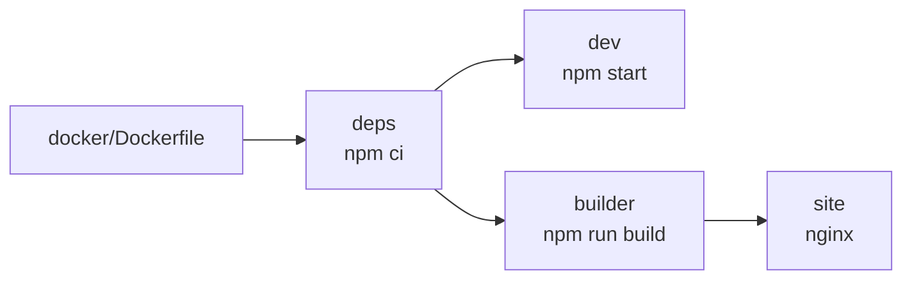

# Docker

Qui gira tutto: non c'è un modo "senza container" di usare questo progetto.
Un solo `Dockerfile` copre l'intero ciclo di vita, con quattro bersagli distinti
che vanno dall'installazione delle dipendenze all'immagine da spedire in
produzione.



## Sviluppo

```bash
docker compose up dev
```

Il sito è su <http://localhost:3000>. La cartella del progetto è montata dentro
il container: modifichi un `.md` sull'host e la pagina si ricarica da sola.

Le dipendenze restano nel container (`node_modules` è un volume separato), così
non ti ritrovi moduli compilati per Linux dentro la cartella del Mac o viceversa.

Per fermare tutto:

```bash
docker compose down
```

## Sito servito da nginx

```bash
docker compose --profile prod up site --build
```

Questo bersaglio costruisce il sito statico e lo serve con nginx su
<http://localhost:8080>. È la stessa immagine che puoi spedire su un server:
dentro non c'è Node, solo HTML, CSS e JavaScript già pronti.

## Comandi occasionali

Tutto quello che non è "avvia il sito" passa da un container usa-e-getta:

```bash
docker compose run --rm dev npm run build
```

```bash
docker compose run --rm dev sh
```

Il primo genera `build/` sull'host; il secondo apre una shell dentro il
container, utile per i comandi che non usi abbastanza spesso da meritare una
scorciatoia. In entrambi i casi, appena il comando finisce il container viene
eliminato.

## Costruire l'immagine da sola

```bash
docker build -f docker/Dockerfile --target site -t docstainer:latest .
```

```bash
docker run --rm -p 8080:80 docstainer:latest
```

L'immagine finale pesa poche decine di megabyte perché parte da
`nginx:alpine` e riceve solo il contenuto di `build/`.

## I bersagli del Dockerfile

| Bersaglio | Base | A cosa serve |
| --- | --- | --- |
| `deps` | `node:22-alpine` | Installa le dipendenze con `npm ci`, in un livello riusabile dalla cache |
| `dev` | `node:22-alpine` | Server di sviluppo con ricarica automatica |
| `builder` | `node:22-alpine` | Esegue `npm run build` e produce `build/` |
| `site` | `nginx:1.27-alpine` | Serve i file statici, è l'immagine da distribuire |

## Dettagli che evitano grattacapi

:::warning La ricarica automatica non funziona
Su alcuni sistemi il container non riceve gli eventi del filesystem dell'host.
Il servizio `dev` avvia già il server con `--poll 1000`, che controlla i file a
intervalli invece di aspettare gli eventi. Se hai un progetto molto grande e la
CPU sale troppo, alza il valore in `docker-compose.yml`.
:::

:::note Sull'host compare una cartella `node_modules` vuota
Non è un errore e non contiene niente: è solo il punto di mount del volume in
cui vivono davvero le dipendenze, dentro Docker. Puoi verificarlo con
`ls -A node_modules`: zero elementi. È già in `.gitignore`, quindi non finisce
nel repository.
:::

:::note Hai cambiato package.json
Le dipendenze sono in un livello dell'immagine, non nel volume montato. Dopo
aver aggiunto un pacchetto ricostruisci il container:
`docker compose up dev --build`.
:::

## nginx

La configurazione è in `docker/nginx.conf` ed è volutamente corta. La riga che
conta è:

```nginx
try_files $uri $uri/ $uri.html $uri/index.html /404.html;
```

Docusaurus genera un file HTML per ogni percorso, quindi nginx deve provare sia
`/docs/intro` sia `/docs/intro.html` prima di arrendersi alla pagina 404 del
sito, che è già tradotta e con il tema giusto.
