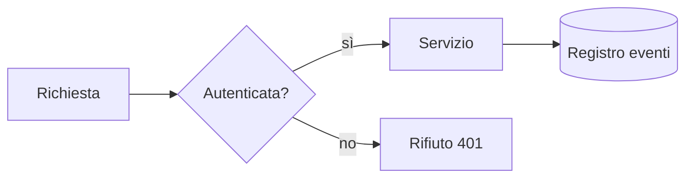
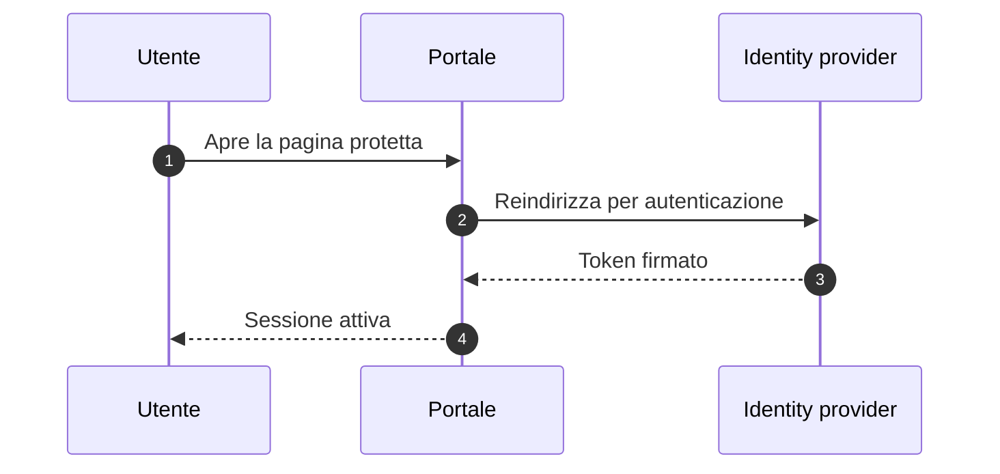
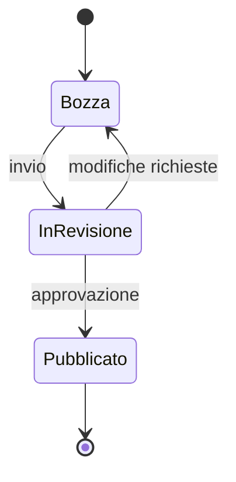
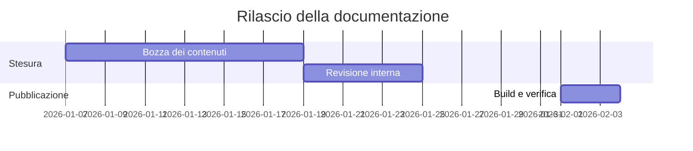

# Diagrammi

I diagrammi si scrivono come testo dentro un blocco `mermaid`. Vengono
disegnati dal browser: nel repository resta solo il codice, che si legge nei
diff e si corregge in un secondo.

## Flusso

````markdown

````


## Sequenza



## Stati



## Gantt



## Consigli

- **Un diagramma, un'idea.** Se devi aggiungere una legenda per farlo capire,
  sono due diagrammi.
- **Etichette brevi.** Mermaid non manda a capo da solo: nodi con frasi lunghe
  producono riquadri enormi.
- **I colori li mette il tema.** Il progetto è configurato per usare la
  variante chiara o scura in automatico; evita di forzare colori a mano, si
  rompono nel tema opposto.
- **Provalo prima** su <https://mermaid.live> se la sintassi non ti torna: è
  più rapido che ricaricare il sito.

:::note Cosa succede fuori da qui
Un lettore Markdown che non conosce Mermaid mostra il blocco come codice: il
contenuto resta leggibile, semplicemente non disegnato. GitHub, invece, i
diagrammi Mermaid li disegna nativamente.
:::
